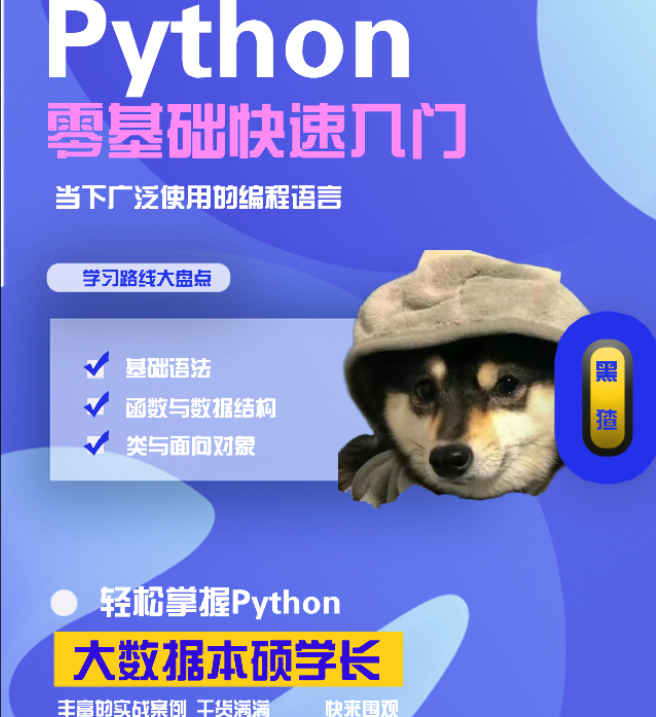
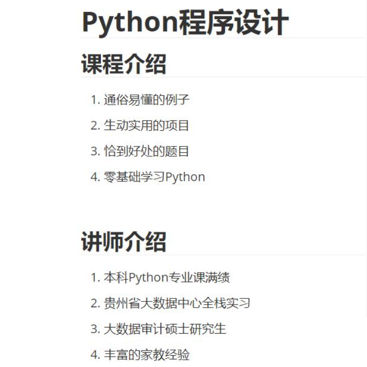
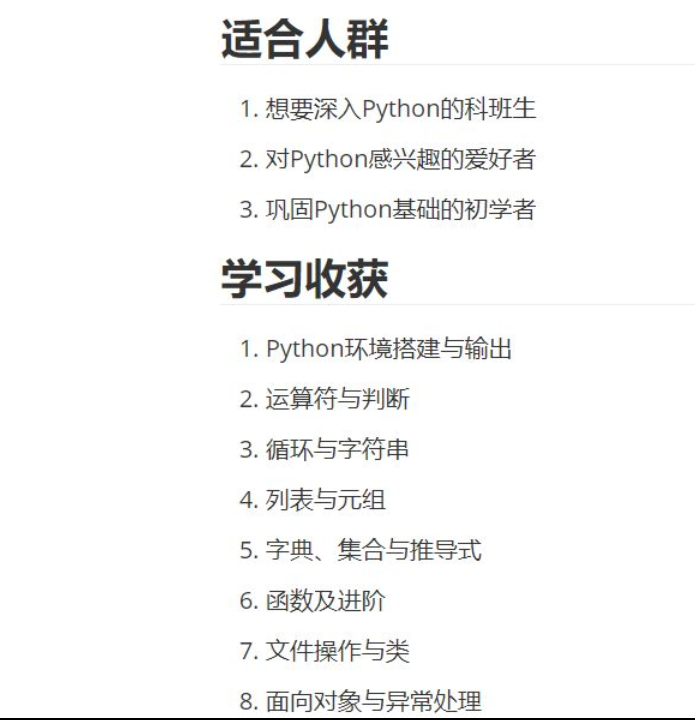

我本科的时候是专业第一，c、java、python等等学科基础课和专业核心课都是最高分。当时的副院长就让我给他朋友的孩子辅导计算机基础，由此开启了我跟[南京外国语学校](http://www.nfls.com.cn/)的缘分，也是通过在南外的辅导经历，让我对技术越发热情，并且让我在大学期间经济独立，[关于我的一些获奖证明~](https://github.com/flowerchar/Nau-Prize)

我辅导的南外小孩，分别保送到了佛罗里达大学、卫斯理女子学院、清华大学、哈佛大学等等众多海外高校（听起来很不可思议）

针对小朋友们的兴趣以及保送要求，我教过技术有：

1. [C语言](https://github.com/flowerchar/CProgramSummary)
2. [Java](https://github.com/flowerchar/JavaProgramSummary)
3. [Python](https://github.com/flowerchar/PythonChowder)
4. [爬虫](https://github.com/flowerchar/StudyDataAnalysis/tree/main/1-%E7%88%AC%E8%99%AB)
5. [数据分析与可视化](https://github.com/flowerchar/StudyDataAnalysis)
6. [游戏开发](https://github.com/flowerchar/StudyPygame)
7. [全栈开发](https://github.com/flowerchar/SelectCourse)

一节课时薪是300-400，在上学期间实现经济独立的成就感，让我深刻意识到技术的重要性，这又使得我产生强烈的学习欲望和动力，形成了良性循环

感谢网络上的开源教程与社区，我将我准备给给南外小朋友们辅导的资源一并奉献出来，这个仓库就是我录制的一套学习Python的课程，如果您感兴趣可以直接clone本仓库然后学习；如果感觉理解不了可以去购买我的课程。

本套课程涵盖基础语法到高级特性，目前已经发布到抖音课堂上啦！！感兴趣的朋友可以[点击此处](https://v.douyin.com/iR56A6SF)

-----

-------

------

